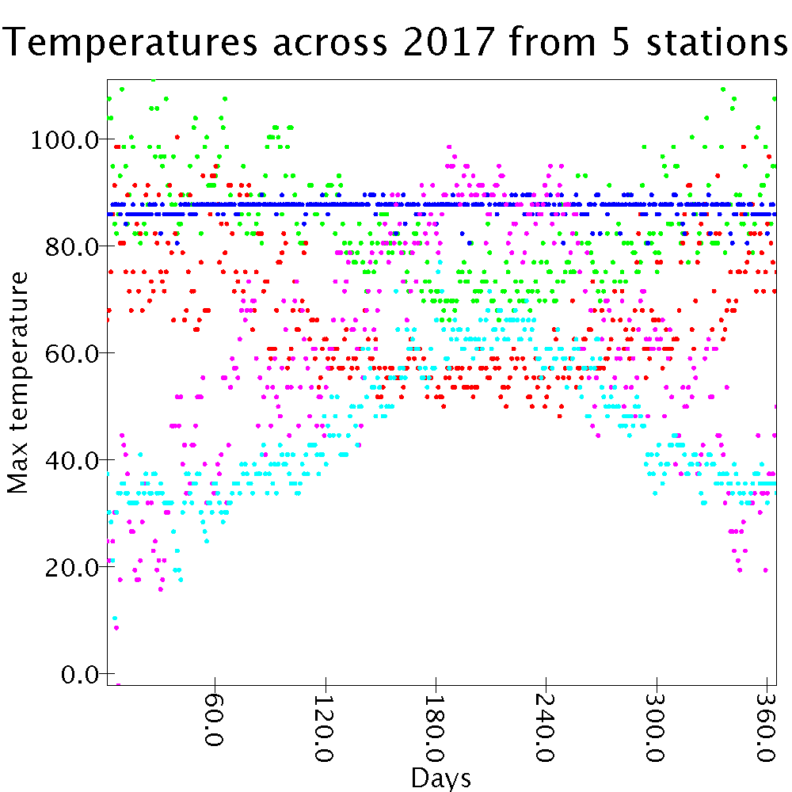

# 09/18 Basic Scala questions

... *pledged Tyler Herron.*

1. There are 4,736 stations in Texas.
2. 2,487 of those stations collected data in 2017.
3. The Elk Creek Oregon station recorded the highest temperature on October 26th, 2017, at 65.6°C, or 150.08°F.
4. 66,449 stations did not report any data in 2017.
5. The maximum recorded rainfall in 2017 in Texas occured on August 29th, 2017 at the "Port Arthur SE TX AP" station. It recorded 661.2 mm, or 26.03 inches, of rainfall.
6. The maximum recorded rainfall in 2017 in India ocurred on March 9th at the IN017111200 station, known as "Bhubaneswar". It recorded 436.1 mm, or 17.17 inches, of rainfall.
7. 30 stations are associated with San Antonio, in that they are located in Texas and contain either "San Antonio" or "SanAntonio" in their station names, which typically relate to the area or city they're in. This is what I presumed as "association," but we could also check their location by searching within a range of latitude and logitude values that correspond to the San Antonio area.
8. Only 4 of those 30 stations reported temperature data in 2017. That is, data in the categories "TMAX", "TMIN", "MDTN", "MDTX", "MNPN", "MXPN", and "TOBS."
9. In order to obtain this value, I considered the maximum temperature of a given day in San Antonio to be an average of all recorded data from that day, by the stations in San Antonio I accumulated earlier. The largest daily increase was from January 8th, 2017 to January 9th, 2017. The daily maximum temperature jumped from 12.20°C to 23.33°C, or 53.96°F to 73.99°F, for a total difference of 11.13°C, or 20.03°F.
10. First, I went about selecting a suitable station based in San Antonio, one that had a good amount of data. The one I selected, the "USW00012921" or the station at the San Antonio International Airport, had data for all 365 days in 2017 for both precipitation and max temperature. The resulting Pearson correlation coefficient was -0.14, suggesting a slight negative correlation, or that the higher the max temperature for a given day, the lower the rainfall.
11. For this problem, I selected the following five stations, arranged by their color on the graph:
    - GREEN: ASN00006105, "Shark Bay Airport"
    - RED: ASN00090182, "Casterton"
    - BLUE: RMW00040604, "Kwajalein"
    - MAGENTA: USC00425182, "Logan Radio KVNU"
    - CYAN: FIE00143316, "Kaskinen Salgrund"
    
    Each station recorded data for the maximum temperature in every day of 2017, which made for a complete graph. On the x-axis, I plotted days ranging from 1 (representing January 1st, 2017) to 365 (representing December 31st, 2017), with their corresponding maximum temperatures (in °F) for each station on the y-axis.
 